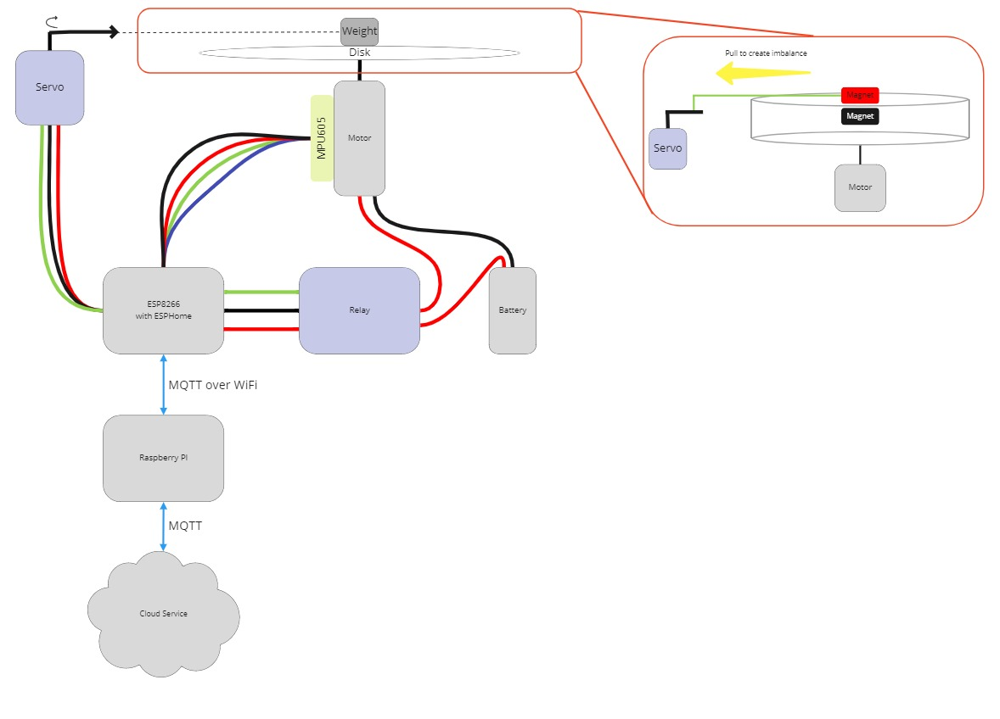

# Edge Cyber Manufacturing
By: V. Geisel & T. Pack

A project within the module "Mobile and distributed systems". The aim of the project is to create a system that monitors health and wear of industrial machines by computing sensor data in the edge and further analysing the data in the cloud.

## Sub-Goals
• Testing the network architecture and type of communication of the individual nodes in
Edge-Computing
• To simulate an application of edge computing in the context of cybermanufacturing
Edge computing-based, data-driven machine health and process monitoring system in the context of cyber manufacturingMobile and Distributed Systems, WS21/22, TH Köln
• Analysis of the data generated by vibration of a motor with imbalance
• Comparison of the speed of classification of a data stream between edge device and cloud

## Prototype

 
## Todo

- [x] Make ESP8266 work with local EMQX
- [x] Build the spinning wheel with adjustable balance
- [x] Try out the ESPHome Config
- [x] Connect ESPHome with NanoMQ or EMQX
- [x] Setup everything on raspberryPi
- [x] Choose cloud
